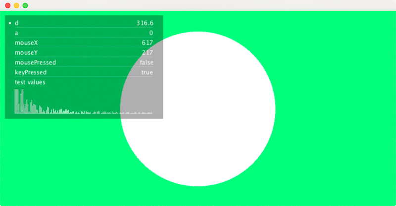

# Inspector


Inspector is a processing library to display the state of variables on screen on top of a processing sketch instead of printing them into the console when developing and debugging a sketch.

## Installation

To install the library, download a release from the [github repository](https://github.com/sojamo/inspector/releases) and copy the unzipped folder _inspector_ into the libraries folder of your processing sketchbook (on osx for example this folder's location is ~/Documents/Processing/libraries).


## Instantiate an Inspector

Simple as that, an Inspector inspecting the state of mouseX, mouseY, mousePressed.

```java
	import sojamo.inspector.*;
	
	Inspector inspector;
	
	void setup() {
		size(800,400);
		inspector = new Inspector(this);
		inspector.add("mouseX","mouseY","mousePressed");
	}
	
	void draw() {
		background(0,255,128);
	}
	
```

## Getting Started

Inspector is a simple helper library that displays the state of variables on top of a processing sketch.



_example 1, see code below_


```java

	import sojamo.inspector.*;

	// some variable we want to observe
	int a = 0;
	int b = 0;
	float d;
	ArrayList l = new ArrayList();
	Test test = new Test();

	void setup() {
		size(800,400,P3D);
		
		// create a new Inspector
		Inspector inspect = new Inspector(this);
		
		// set initial parameters for our Inspector
		inspect.setSize(320,210).setPosition(10,10).setSpacing(20);
		
		// add some variable names you want to observe to the Inspector
		inspect.add("d","a","mouseX", "mouseY", "mousePressed");
		inspect.add("keyPressed","test values","test values size","frameCount");
	  
		// An Inspector element is of type Map.
		// the code line below makes changes to the inspector element 'test values' 
		// there are 7 parameters that are passed on to the inspector
		// the 1st parameter is the named index of the observed element
		// the following parameters must be read as pairs.
		// ("min",0 is a [air with key=min and value=0)
		// These will be added to the inspector element as a key and value
		// here the min, max, scale pairs are used to customize the 
		// display element 'test values'
		inspect.change("test values", "min", 0, "max", 50, "scale", 0.5);
	}

	void draw() {
		background(0,255,128);
		noStroke();
		// change variable d, the current state is reflected 
		// in the inspector block
		d = abs(sin(frameCount*0.01)) * 400;
		translate(width/2, height/2);
		ellipse(0,0,(float)d,(float)d);
		test.update();  
	}

	void mousePressed() {
		// make some changes; the states of the following
		// variables are reflected in the inspector block
		a += 1;
		l.add(123);
		l.add(234);
	}


	class Test {
		ArrayList values = new ArrayList();
		Test() {
			update();
		}
		
		void update() {
			values.clear();
			for(int i=0;i<140;i++) {
				values.add(random(0,100)/(i*0.1));
			}
		}
		
		public String toString() {
			return "Testing";
		}
	}
	
```


## Current Status

The Inspector Library is currently in an early stage, error reports, recommendations for improvements and suggestions can be posted inside the [issues](https://github.com/sojamo/inspector/issues) section.


